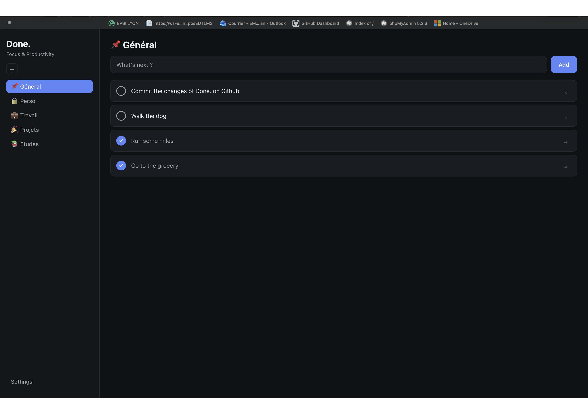
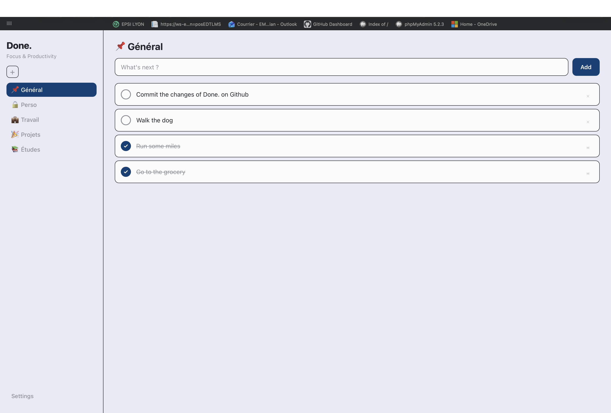

<div align="center">

# Done.

### Focus & Productivity — a minimal, self-hosted to-do app

A clean task manager built from scratch in vanilla TypeScript, PHP, and MySQL. Organize tasks into lists, switch between dark and light themes, and work in French or English — no framework, no clutter.

<br>


</div>

---

> [NOTE]
> **Done. is a work in progress.** It's actively being built and isn't feature-complete yet. The app currently runs locally during development and will be deployed to a hosted environment later, so this README focuses on what the project *is* and how it's structured rather than on local setup steps.

---

## Overview

**Done.** is a personal productivity app centered on one idea: a quiet, distraction-free place to capture and finish tasks. Users sign up, organize their work into named lists, and check items off as they go. The interface is deliberately restrained — a sidebar of lists, a single input bar, and a column of tasks — with a dark-first aesthetic and a light theme for those who prefer it.

It's built **without any framework**: a typed TypeScript frontend talking to a small PHP/JSON API over `fetch`, backed by a MySQL database accessed through PDO. The goal is a codebase that stays simple and legible while covering the real fundamentals — authentication, relational data, a clean API surface, theming, and internationalization.

---

## Features

| Tasks & Lists | Experience | Account |
|:---|:---|:---|
| Create, complete, and delete tasks | Dark / light theme with persistence | Sign up with email, username, password |
| Multiple named lists per user (with emoji labels) | French / English interface (i18n) | Login with `bcrypt` + PHP sessions |
| Right-click a list to rename or delete | Settings panel (account, display, language) | Session-guarded API on every endpoint |
| Auto-created "Général" list per user | Toggle visibility of the "Général" list | Auto-redirect to login when the session expires |
| Completed tasks sink and strike through | Keyboard-friendly (Enter to add) | Logout |

---

## Screenshots

> The interface in its dark-first form, plus the light theme.

### The app — dark theme
Sidebar of lists on the left (you start with the `General` list, then you add yours), task input and task cards on the right. Completed tasks are struck through and pushed to the bottom.



### The app — light theme
The same interface with the light theme applied (toggled from the bottom-left).



---

## Tech Stack

- **Frontend:** TypeScript (strict mode), compiled to ES modules in `front/js/`. Plain DOM APIs, no framework.
- **Backend:** PHP 8 — a small set of JSON endpoints under `api/`, each session-guarded.
- **Database:** MySQL / MariaDB via PDO with prepared statements.
- **Styling:** A single hand-written CSS file driven by CSS custom properties, with automatic and manual dark/light theming.
- **i18n:** A lightweight dictionary (`dico.ts`) keyed by `data-i18n` attributes, with the choice stored in `localStorage`.
- **Branding:** Custom "Done." logotype and an SVG + PNG favicon kit (Outfit-style wordmark, "D." monogram).

---

## Architecture

The frontend never renders server-side. Pages are static HTML shells; TypeScript hydrates them and talks to the API over `fetch`, receiving JSON. To avoid a flash of unauthenticated content, the app starts hidden and only reveals itself once the session is confirmed — if the API answers `401`, the user is sent straight to the login page.

```
┌──────────────────────────┐         fetch (JSON)        ┌──────────────────────────┐
│        Frontend          │  ─────────────────────────► │        PHP API           │
│  TypeScript → ES modules │                             │   session-guarded        │
│  index / login / register│  ◄───────────────────────── │   endpoints in /api      │
└──────────────────────────┘     JSON · 401 → login       └────────────┬─────────────┘
                                                                        │ PDO
                                                                        ▼
                                                              ┌───────────────────┐
                                                              │      MySQL        │
                                                              │ users·lists·tasks │
                                                              └───────────────────┘
```

### API endpoints

| Endpoint | Purpose |
|:---|:---|
| `register.php` | Create an account (hashes the password, checks email uniqueness) |
| `login.php` | Authenticate and open a session |
| `logout.php` | Destroy the session |
| `get_user.php` | Return the current user's profile |
| `get_lists.php` / `add_list.php` / `update_list.php` / `delete_list.php` | List CRUD |
| `get_tasks.php` / `add_task.php` / `update_task.php` / `delete_task.php` | Task CRUD (update toggles completion) |

Every data endpoint checks `$_SESSION['user_id']` first and returns `Unauthorized` (`401`) if it's missing.

---

## Database Schema

Three tables, scoped per user, with cascading deletes.

```
┌─────────────────────┐      ┌──────────────────────┐      ┌──────────────────────┐
│        users        │      │        lists         │      │        tasks         │
├─────────────────────┤      ├──────────────────────┤      ├──────────────────────┤
│ id (PK)             │◄──┐  │ id (PK)              │◄──┐  │ id (PK)              │
│ username            │   └──│ user_id (FK)         │   └──│ list_id (FK)         │
│ email (unique)      │      │ name                 │      │ user_id (FK)         │
│ password (bcrypt)   │      └──────────────────────┘      │ title                │
│ created_at          │                                    │ is_completed (0/1)   │
└─────────────────────┘                                    │ created_at           │
                                                           └──────────────────────┘
```

- Foreign keys use `ON DELETE CASCADE`, so deleting a user cleans up their lists and tasks.
- A SQL **trigger** (`after_user_insert`) automatically creates a default "📌 Général" list for every new user, guaranteeing there's always somewhere to put a task.
- The schema ships with a small **demo dataset** (one user, a few emoji-labelled lists, and sample tasks) so the app has something to show on a fresh install.

---

## Project Structure

```
Done./
├── Done_.sql                 # Schema + after_user_insert trigger + demo data
├── tsconfig.json             # Strict TS config (rootDir: front/ts → outDir: front/js)
├── LICENSE                   # MIT
│
├── api/                      # PHP JSON API
│   ├── config.example.php    # Template DB config (copy to config.php)
│   ├── register.php · login.php · logout.php · get_user.php
│   ├── get_lists.php · add_list.php · update_list.php · delete_list.php
│   └── get_tasks.php · add_task.php · update_task.php · delete_task.php
│
└── front/
    ├── index.html · login.html · register.html
    ├── ts/                   # TypeScript sources
    │   ├── app.ts            # Main app: lists, tasks, settings, theme, i18n, auth guard
    │   ├── auth.ts · register.ts
    │   ├── Tache.ts          # Task model
    │   └── dico.ts           # Translation dictionary (fr / en)
    ├── js/                   # Compiled output
    ├── css/style.css         # Themed design system (CSS variables)
    └── assets/               # Logotype, favicon kit, screenshots
```

> `api/config.php` is intentionally kept out of version control — `config.example.php` is the template to copy and fill in.

---

## Security Notes

- Passwords are hashed with **bcrypt** (`password_hash` / `password_verify`) — never stored in plain text.
- The API uses **PDO prepared statements** throughout, guarding against SQL injection.
- Every data endpoint is **session-guarded** and scopes its queries to the logged-in `user_id`, so users can only touch their own lists and tasks.
- The frontend reacts to a `401` by redirecting to login, and stays hidden until the session is confirmed.
- Email uniqueness is enforced at both the application and database level.

---

<div align="center">

A personal project by [**Brian**](https://github.com/Brian-Emp) · built in the open, still growing.

*Get it Done.*

</div>
